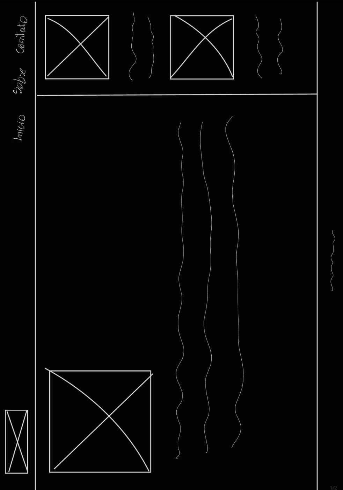
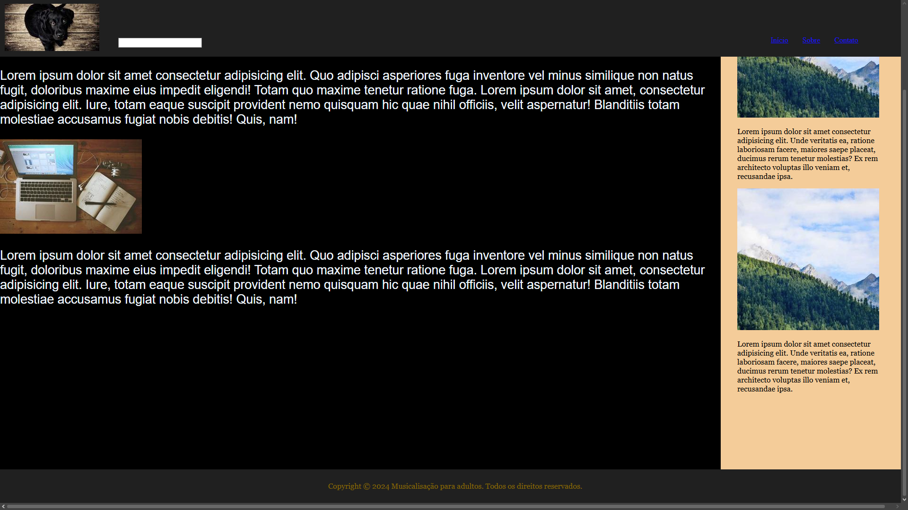

# Trabalho Prático - Semana 04

Dessa vez, vamos escolher uma proposta de projeto para trabalhar.

Nessa atividade, você deverá montar a página inicial do projeto escolhido, a organização do HTML aplicando semântica correta e uso aprimorado do CSS. Leia o enunciado completo no Canvas para mais detalhes.

**IMPORTANTE:** Você deve trabalhar e alterar apenas arquivos dentro da pasta **`public`**. Deixe todos os demais arquivos e pastas desse repositório inalterados. **PRESTE MUITA ATENÇÃO NISSO.**

## Informações Gerais

- Nome: Estevão Jung
- Matricula: 910950
- Proposta de projeto escolhida: Pagina de prestação de serviços: Musicalisação para adultos.
- Breve descrição sobre seu projeto: Uma pagina onde o usuario pode conhecer e contratar serviços de musicalisação para adultos.  

## Print do(s) wireframe(s) criado

## Print da home-page criada

